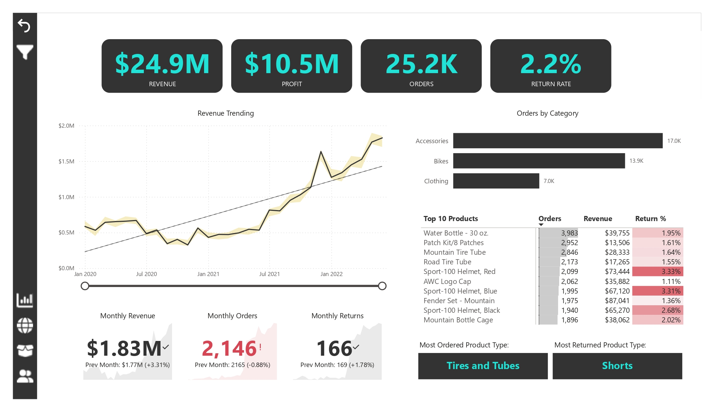
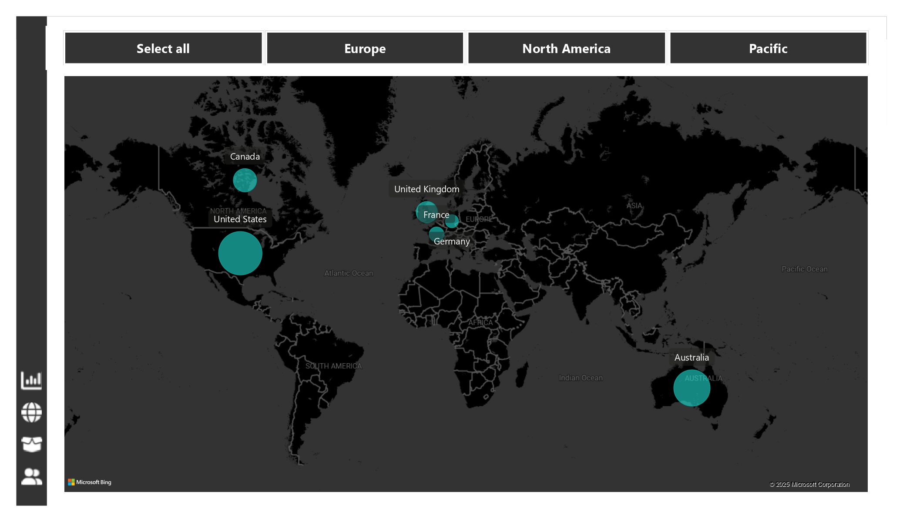
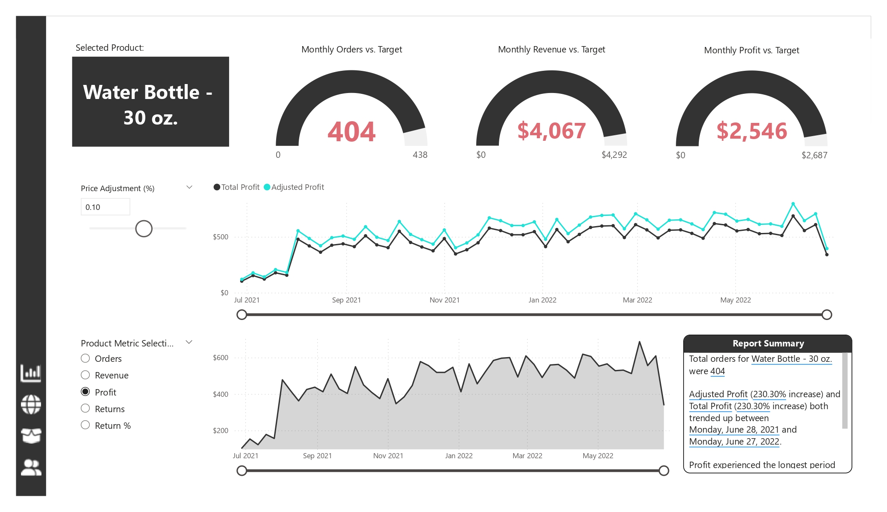
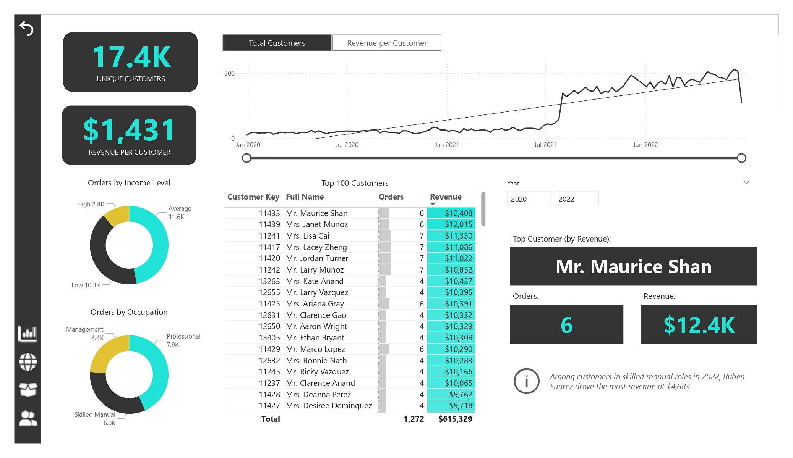
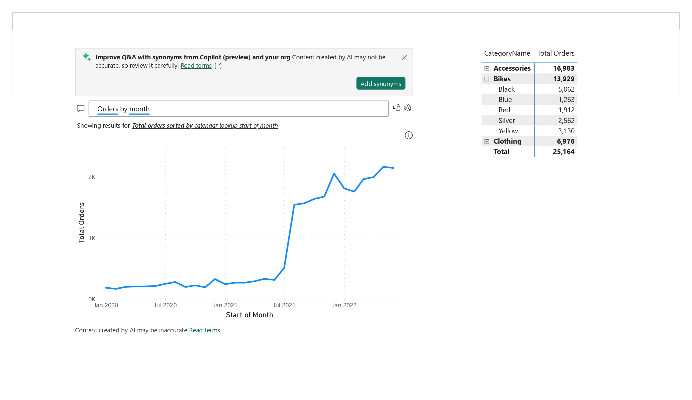
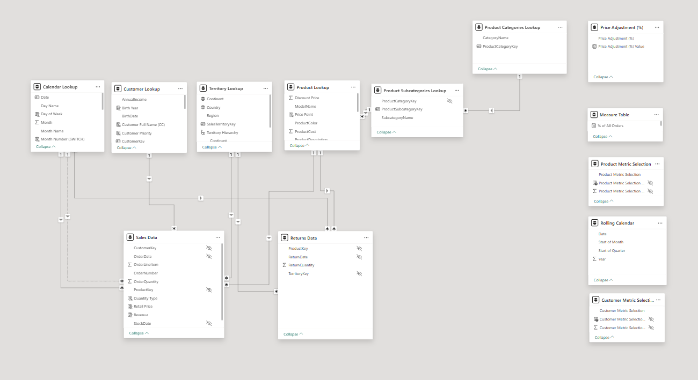

# 🚴‍♂️ Power BI Sales Dashboard – Bicycle Company

A fully interactive Power BI report built to analyze key business metrics of a fictional bicycle company. The report highlights insights across sales, profitability, returns, customer demographics, and product performance.

---

## 🖼️ Dashboard Overview

---

## 📊 Report Pages Breakdown

### 📌 Page 1: Executive Summary
- KPIs showing **Total Revenue ($24.9M)**, **Profit ($10.5M)**, **Orders (25.2K)**, and **Return Rate (2.2%)**
- Revenue trend analysis across 2.5 years
- Orders by category (Bikes, Accessories, Clothing)
- Top 10 products with **Return % analysis**
- Highlighted most ordered and most returned product types

---

### 📌 Page 2: Performance vs Targets

- Monthly KPIs benchmarked against internal targets
- Actual vs Target tracking for Revenue, Profit, and Orders
- Time series visualization to monitor under/over performance

---

### 📌 Page 3: Product-Level Profit Analysis

- Product-level metrics (Orders, Revenue, Returns)
- Dynamic selection for time period and metric
- Adjusted vs. Total Profit trend for selected product

---

### 📌 Page 4: Customer Segmentation

- Customer breakdown by **Income Level** and **Occupation**
- Revenue per customer and unique customer count
- Top customers by order volume and revenue contribution

---

### 📌 Page 5: Key Influencer Analysis

- AI-generated visuals identifying **drivers of Homeownership**
- Factors influencing **Retail Price**
- Useful for understanding customer behavior drivers

---

### 📌 Page 6: Data Model View

- Visual layout of the **data model** used
- Fact and dimension tables clearly linked with relationships
- Optimized for slicing and interactive analysis

---

## 🛠 Tools & Skills Used

- **Power BI Desktop**
- DAX (Data Analysis Expressions)
- Power Query for ETL
- Data modeling & relationships
- Slicers, tooltips, and drilldowns
- Key Influencers (AI visual)
- Performance monitoring and storytelling

---

## 🎯 Purpose of This Project

This self-directed project demonstrates:
- Proficiency in Power BI dashboard development
- Ability to communicate insights effectively
- Simulating business decision-making using fictional data

---

## 📂 Repository Structure

# Power BI Sales Dashboard – Bicycle Company (Fictional Dataset)

This is a self-directed data analytics project built using **Microsoft Power BI** to simulate executive-level reporting for a fictional bicycle company. The report provides deep insights into sales, profitability, product returns, and customer behavior across regions and time periods.

##  Dashboard Highlights

- **$24.9M Revenue** and **$10.5M Profit** overview
- Monthly trends in **Revenue**, **Orders**, and **Returns**
- Drilldown by **Product Category**, **Top Products**, and **Return Rates**
- Geographic performance: **United States**, **Australia**, **UK**, **France**, **Germany**
- **Customer Segmentation** based on Occupation, Income, and Order Behavior
- **Key Influencer Visuals** for retail price and homeownership patterns
- Performance vs. **Monthly Targets** (Revenue, Profit, Orders)

## Tools Used

- **Power BI Desktop**
- DAX (Data Analysis Expressions)
- Power Query (ETL)
- Data modeling

